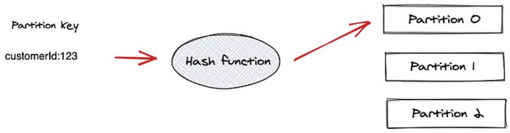

---

### Key Interview Questions

- How does partitioning of topics take place?
- How does Kafka ensure message ordering?
- Can consumers read the same message again and again?
- What happens when new consumers are added?
- What happens when some brokers go down?
- Can consumers read messages after a few days they are produced?

---

### Partitioning Logic

**How does partitioning take place?**

When a producer sends an event, it goes to a specific partition based on:

**With a partition key** — Producer assigns a key (e.g., `customerId: 123`) to the event. Kafka runs it through a hash function → same key always goes to the same partition.

  

> Good partition keys: user ID, order ID, device ID — anything that groups related events together.

**Without a partition key** — Kafka uses **round-robin** assignment, spreading events evenly across partitions.

**How does Kafka ensure message ordering?**

Ordering is **guaranteed within a partition** — events in the same partition are always consumed in the order they were written. So if you want related events (e.g., all events for the same order ID) to be in order, use the order ID as the partition key — all those events go to the same partition.

> If no partition key is used, events spread across partitions and ordering **cannot be guaranteed**.

---

### Reading Records from Partitions

Unlike RabbitMQ (push-based), **Kafka uses a pull-based model** — consumers fetch data from brokers at their own pace. This gives consumers full control — they decide when to read, how fast, and from which offset.

- Consumer connects to a partition in a broker
- Reads messages in the order they were written
- Remembers the **last consumed offset** for each partition
- On next pull, continues from where it left off

**Can consumers read messages after a few days?** Yes — Kafka does not delete messages after consumption. Messages stay until the retention policy removes them. A consumer can even go back to an earlier offset and reprocess old messages (within the retention window).

#### Consumer Lag

Consumer lag = difference between the latest offset in a partition and the consumer's current offset. High lag means consumers are falling behind producers — a critical metric to monitor in production.

**Consumer crash recovery** — Kafka stores committed offsets in an internal topic called `__consumer_offsets`. Consumers periodically commit their offsets, and on restart, resume from the last committed position. Note: offsets are not automatically updated after every message — this depends on the commit strategy (auto or manual).

#### Offset Commit Strategies

- **Auto commit** — Kafka periodically commits offsets automatically at a configured interval
- **Manual commit** — application explicitly commits offsets after processing

> Manual commit gives better control and prevents data loss on crashes, but may lead to duplicate processing if a message is processed but the commit fails before the next restart.

---

### Consumer Groups

**Can consumers read the same message again and again?**

Without consumer groups — yes, multiple instances of the same service would all read the same event, causing duplicate processing (e.g., 4 instances of Inventory Service all reducing stock for the same order).

**Consumer Groups** solve this. A group ID ties multiple consumer instances together — Kafka ensures each partition is assigned to only one consumer within the group at a time.

  

- **Within a group** — each partition goes to only one consumer, no parallel processing of the same partition within a group
- **Across groups** — both Group A and Group B receive all events independently (e.g., Inventory Service group and Notification Service group both get the `order-placed` event)

**Max parallelism = number of partitions**, not number of consumers. If you have 10 consumers but only 2 partitions, only 2 consumers work — the other 8 sit idle. To increase parallelism, increase partitions.

> Key rule: **number of active consumers ≤ number of partitions**.

---

### Rebalancing

**What happens when new consumers are added?**

Rebalancing = re-assignment of partition ownership among consumers in a group so every consumer gets one or more partitions.

Rebalancing happens when:

- A new consumer joins the group
- An existing consumer goes down
- New partitions are added
- A consumer is considered dead (hasn't pulled within the configured timeout)

> During rebalancing, message consumption **pauses temporarily**, which can impact throughput.

> One consumer in the group is elected as the **Group Leader** (responsible for partition assignment), but this is managed automatically by Kafka.

---

### Partition Replication

**What happens when some brokers go down?**

Replication = copying a partition to other brokers for fault tolerance. Each partition has one **leader** and one or more **followers** (replicas).

  

- Producer always writes to the **leader** partition
- Leader replicates data to all followers
- If a leader goes down, a follower is **automatically elected** as the new leader
- System continues operating, and data durability depends on replication settings and acknowledgement configuration

> `replication.factor=3` means 3 copies of each partition across 3 different brokers. Requires at least 3 brokers.

---

### In-Sync Replicas (ISR)

Not all replicas are always fully up-to-date:

- **ISR** = replicas that are fully synced with the leader
- Only ISR replicas acknowledge writes when `acks=all`
- Only ISR replicas are eligible to become the new leader if the current leader goes down
- If a replica falls behind, it is **removed from the ISR** and won't be used for acknowledgements or leader election until it catches up

---

### Kafka Brokers Management (KRaft)

Someone needs to track which broker is alive, which partition has which leader, etc.

**Previously:** ZooKeeper handled this as a separate system.

**Now:** Kafka uses **KRaft (Kafka Raft consensus protocol)** — brokers coordinate directly with each other to elect a leader and manage cluster state. No separate ZooKeeper needed.

---

### Kafka Log Retention

Controls how long messages are kept in a topic. Configured per topic:

|Config|Description|
|---|---|
|`retention.ms`|Keep messages for this many milliseconds (e.g., 7 days)|
|`retention.bytes`|Keep messages up to this size per partition|
|`retention.ms=-1`|Keep messages indefinitely (watch storage costs!)|

> Whichever limit (`retention.ms` or `retention.bytes`) is hit first triggers deletion. Old messages are deleted in the background.

---

### Acks and Retries

**Acks** = how many acknowledgements the producer needs from brokers before considering a message successfully sent.

|acks value|Behaviour|Speed|Reliability|
|---|---|---|---|
|`0`|Producer sends and forgets — no acknowledgement waited|Fastest|No guarantee|
|`1`|Leader broker acknowledges receipt|Medium|Data safe on leader only|
|`all` / `-1`|All in-sync replicas (ISRs) acknowledge|Slowest|Highest guarantee|

> `acks=all` is the safest — message is confirmed only after all in-sync replicas (ISR) acknowledge it.

**Retries** — if a send request fails (network issue, broker down), producer automatically retries up to the configured `retries` count.

- Useful for transient failures — broker temporarily down, network blip
- Combined with `acks=all` — provides strong durability guarantees as long as in-sync replicas are available
- Configurable: `retries`, `retry.backoff.ms` (wait time between retries)

> Because retries can lead to duplicate messages, consumers should be **idempotent** — designed to safely handle the same message being processed more than once.

> Consumer-side fault tolerance and retry strategies are covered in code when implementing consumers.

---

### Interactive Tool

- [Kafka Visualization — Softwaremill](https://softwaremill.com/kafka-visualisation/) — simulate producers, consumers, partitions, brokers and replication in real time. Great for understanding how all components work together.